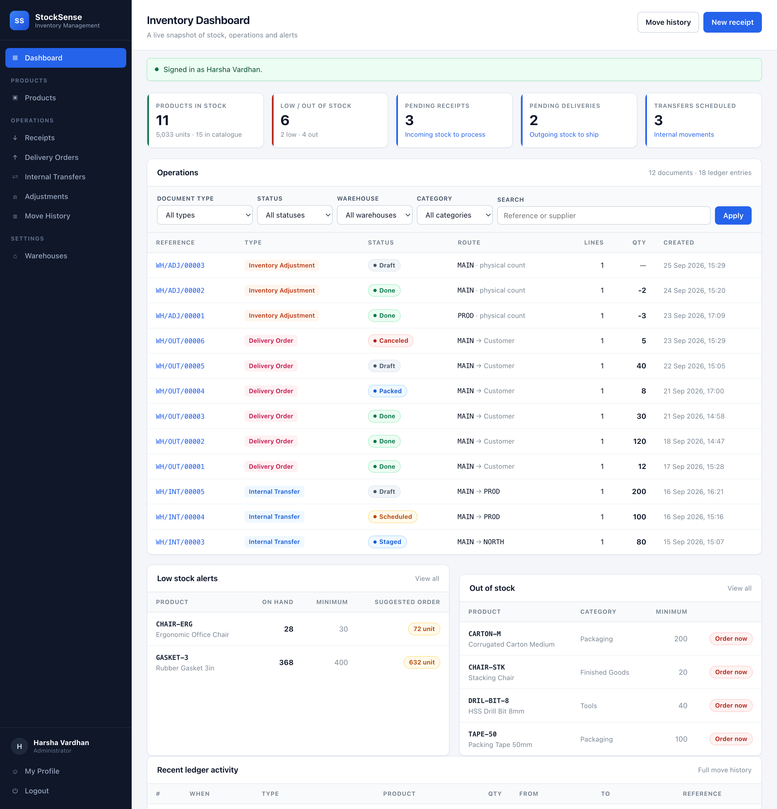
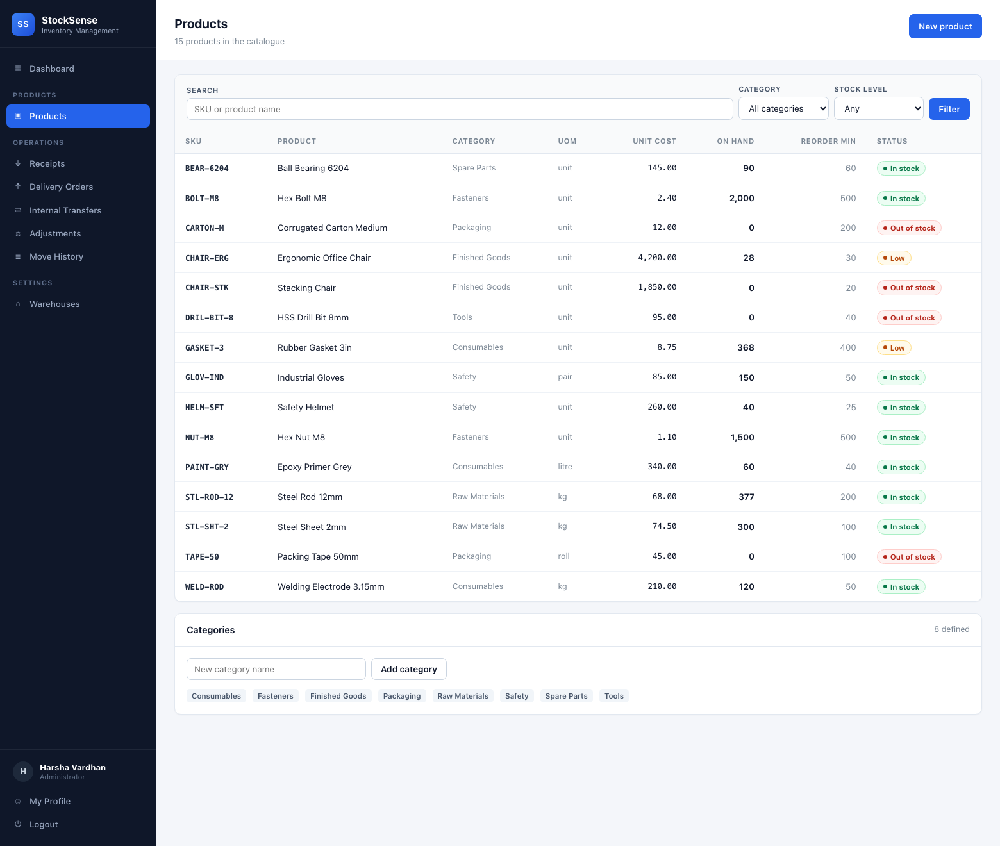
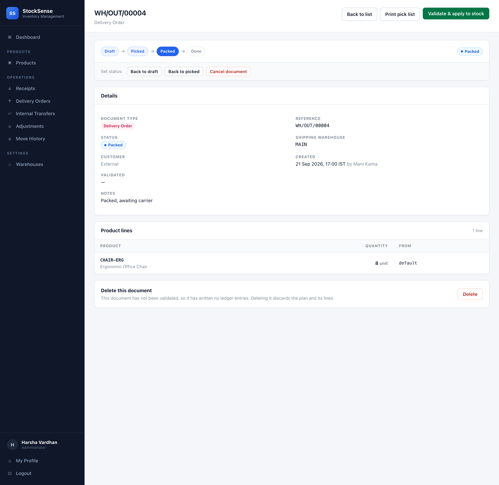
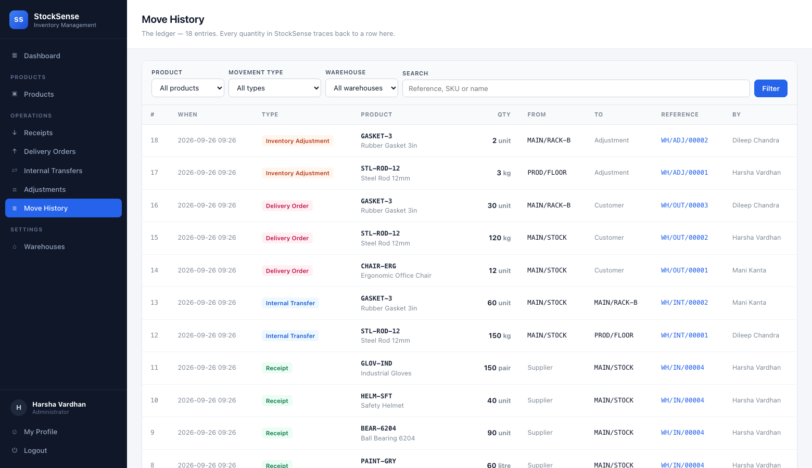
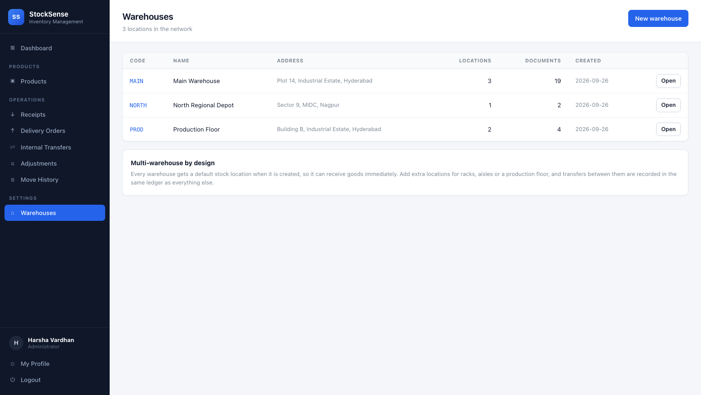

# StockSense

**Real-time inventory tracking across warehouses.** StockSense replaces paper
registers and month-end spreadsheet reconciliation with an append-only movement
ledger, and stock levels that are always *derived* — never guessed.

Built for **Odoo Hackathon 2026**.



---

## Quickstart

```bash
python3 -m venv .venv && source .venv/bin/activate
pip install -r requirements.txt

python -m app.seed     # build the demo database
python run.py          # http://127.0.0.1:5000
```

Sign in with **`admin@stocksense.dev`** / **`demo1234`**.

The seeder creates three warehouses, fifteen products, and twelve documents
across every status — so the dashboard, alerts and ledger all have something
real in them the moment you sign in.

## What is built

Every item in the problem statement, working:

| Spec requirement | Where |
| --- | --- |
| Sign up / log in | `/signup`, `/login` |
| OTP-based password reset | `/forgot-password` → `/reset-password` |
| Redirect to dashboard after auth | `/` |
| KPI — total products in stock | Dashboard |
| KPI — low stock / out of stock items | Dashboard |
| KPI — pending receipts | Dashboard |
| KPI — pending deliveries | Dashboard |
| KPI — internal transfers scheduled | Dashboard |
| Filter by document type | Dashboard, every operation list |
| Filter by status (draft/waiting/ready/done/canceled) | Dashboard, every operation list |
| Filter by warehouse or location | Dashboard, every operation list |
| Filter by product category | Dashboard, every operation list |
| Products — create, update, categories, UoM | `/products` |
| Products — stock availability per location | Product detail |
| Products — reordering rules | Product detail, low-stock alerts |
| Receipts — supplier, products, quantities, validate | `/operations/receipt` |
| Delivery orders — pick, pack, validate | `/operations/delivery` |
| Internal transfers — warehouse to warehouse, rack to rack | `/operations/internal` |
| Inventory adjustment — counted quantity vs recorded | `/operations/adjustment` |
| Move history (the ledger) | `/moves` |
| Settings — warehouses and locations | `/settings/warehouses` |
| Profile menu — my profile, logout | Sidebar |
| Low stock alerts | Dashboard, `/products?stock=low` |
| Multi-warehouse support | Everywhere |
| SKU search and smart filters | Products, moves, documents |

## The idea that carries the design

> **The movement ledger is the only source of truth. Stock levels are derived.**

Every change to inventory is an immutable row in `stock_moves`. On-hand
quantities are computed by folding that table — there is no stored level
anywhere in the database, and no code path that sets one. Three consequences
fall out for free:

- **Levels cannot drift from history**, because there is only one number and it
  is computed from the moves.
- **Every figure is explainable.** "Why is it 377?" — open the move history and
  count the rows.
- **Audit is a by-product**, not a feature someone has to build later.

A second rule keeps the two halves honest: **documents carry a status workflow,
and stock changes only when a document is validated.** A draft receipt is a
plan. Validating it is the moment goods are real.

```
draft ──→ waiting ──→ ready ──→ done          done = stock has moved
  └──────────────────────────→ canceled        canceled = it never will
```

The system also refuses to record impossible states. Try to deliver more than
you hold and it will not let you:

```
Not enough stock: CHAIR-ERG has 28 at MAIN/STOCK but the document needs 99999
```

## Architecture

```
┌──────────────────────────────────────────┐
│  Dashboard / operator UI                 │   Jinja2 templates
└──────────────────┬───────────────────────┘
┌──────────────────▼───────────────────────┐
│  Flask views  (auth, products, ops, ...) │   blueprints
└──────────────────┬───────────────────────┘
┌──────────────────▼───────────────────────┐
│  app/engine.py — the domain              │   no Flask, no HTTP
│  ledger · derived levels · validation    │
└──────────────────┬───────────────────────┘
┌──────────────────▼───────────────────────┐
│  SQLite — stock_moves is append-only     │   v_stock_levels view
└──────────────────────────────────────────┘
```

Deliberately boring technology: Flask, SQLite, server-rendered HTML, one
hand-written stylesheet. No build step, no bundler, no `node_modules`. It runs
on a laptop with two commands and it will run on the demo machine.

`app/engine.py` holds every rule that matters and knows nothing about HTTP.
That is the layer to read if you want to understand the system.

## Project layout

```
.
├── app/
│   ├── __init__.py            # app factory, template filters
│   ├── db.py                  # SQLite access layer
│   ├── schema.sql             # tables + the derived-levels view
│   ├── engine.py              # the domain: ledger, levels, validation
│   ├── auth.py                # signup, login, OTP reset, profile
│   ├── views_dashboard.py     # KPIs and filters
│   ├── views_products.py      # catalogue
│   ├── views_operations.py    # receipts, deliveries, transfers, adjustments
│   ├── views_settings.py      # warehouses and locations
│   ├── seed.py                # demo dataset
│   ├── templates/             # Jinja2
│   └── static/css/app.css     # the whole stylesheet
├── tests/test_app.py          # 78 end-to-end tests
├── reference/                 # standalone domain spec, stdlib only
├── docs/                      # domain model, architecture, roadmap
├── spec/openapi.yaml          # REST contract
└── run.py
```

## Tests

```bash
python -m unittest discover -s tests     # 78 application tests
cd reference && python -m unittest       # 53 domain invariant tests
```

The application suite drives the real Flask app against a throwaway database:
every route, every workflow, every status transition, and the domain invariants
re-checked against real SQL. The reference suite pins the semantics
independently of any framework.

`reference/` is a standalone, dependency-free implementation of the domain with
its own test suite. It exists so the inventory rules can be reasoned about and
tested without Flask, SQLite or HTTP in the way.

## Documentation

| Document | What it covers |
| --- | --- |
| [`docs/domain-model.md`](docs/domain-model.md) | Entities, move kinds, status workflow, invariants |
| [`docs/architecture.md`](docs/architecture.md) | Layering, module boundaries, stack decision |
| [`docs/DESIGN-RATIONALE.md`](docs/DESIGN-RATIONALE.md) | Why the design is this way, and where it is weak |
| [`docs/roadmap.md`](docs/roadmap.md) | Phases, workstreams, demo script |
| [`docs/SUBMISSION.md`](docs/SUBMISSION.md) | Hackathon submission checklist |
| [`spec/openapi.yaml`](spec/openapi.yaml) | REST contract |
| [`CONTRIBUTING.md`](CONTRIBUTING.md) | Branch strategy, commit conventions, PR flow |

## Screenshots

| | |
| --- | --- |
|  |  |
|  |  |

## Team

| GitHub | Role |
| --- | --- |
| [@dileepchandra07](https://github.com/dileepchandra07) | Repository owner |
| [@bit-odoo](https://github.com/bit-odoo) | Collaborator |
| [@Xranger-rootX](https://github.com/Xranger-rootX) | Collaborator |
| [@kottanamanikanta1-dot](https://github.com/kottanamanikanta1-dot) | Collaborator |

## Known limitations

Honest list, so nobody is surprised on stage:

- **OTP reset has no mail service.** The code is displayed on screen in demo
  mode, clearly labelled. Swapping in a real send touches one function.
- **No role enforcement.** The role field is recorded and displayed, but every
  signed-in user can do everything. Real deployments need permission checks.
- **Levels are folded on every read.** Correct and simple; O(moves). Fine at
  demo scale, and `docs/domain-model.md` describes the cache to add later.
- **No CSRF tokens.** Flask-WTF would be the fix. Acceptable for a demo, not for
  production.
- **Reservations, lot tracking and multi-UoM conversion are out of scope** —
  listed in the domain model's omissions section.

## License

MIT — see [`LICENSE`](LICENSE).
